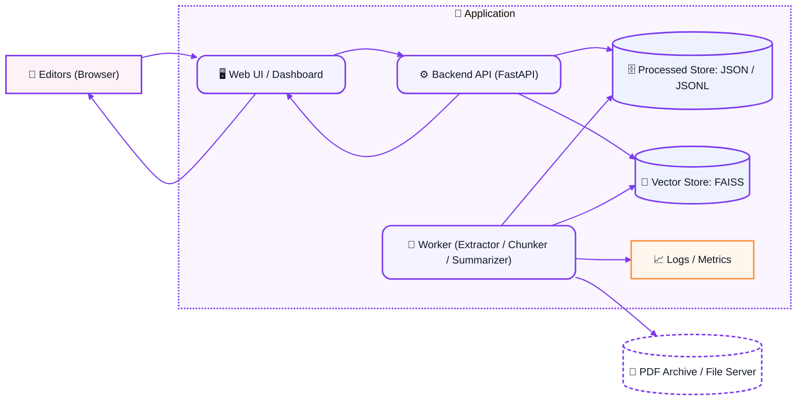

# 📰 The Berliner Search

**The Berliner Search** is an AI-assisted research tool that transforms _The Berliner_ magazine’s PDF archive into structured, searchable data — enabling journalists, editors, and researchers to explore the publication’s history through intelligent semantic search.

---

## 🎯 MVP Goal

Convert static PDFs into a searchable dataset that combines summarization and semantic retrieval.

### Current Features

- ✅ PDF extraction and parsing (text + metadata)
- ✅ NLP preprocessing: cleaning, chunking, and normalization
- ✅ Summarization using **T5-small**
- ✅ Metadata tagging (issue, page, section)
- ✅ Embedding generation with **MiniLM-multilingual**
- ✅ FAISS-based semantic search
- ✅ Evaluation scripts for quick precision testing

### Project Status (October 2025)

🚀 **Stage 6 — Baseline model integrated**

The current production model is  
`sentence-transformers/paraphrase-multilingual-MiniLM-L12-v2`,  
supporting both English and German queries.

---

## 🧩 System Architecture – The Berliner Search MVP

- Editors interact with a Web Dashboard, which talks to a FastAPI backend.
- The backend serves content from two stores:

1. A Processed JSON store (for summaries)

2. A Vector store (for semantic search).

- Meanwhile, a background worker reads new PDFs from the archive, processes them (extract, clean, chunk, summarize), and writes the results back to those stores — logging everything along the way.

- The user → API → data → UI loop makes the system interactive;
- the worker → stores pipeline keeps data updated.

# 👩‍💻 Author

Developed by **Vanesa Yepes**
AI Product Management Capstone Project (2025)
