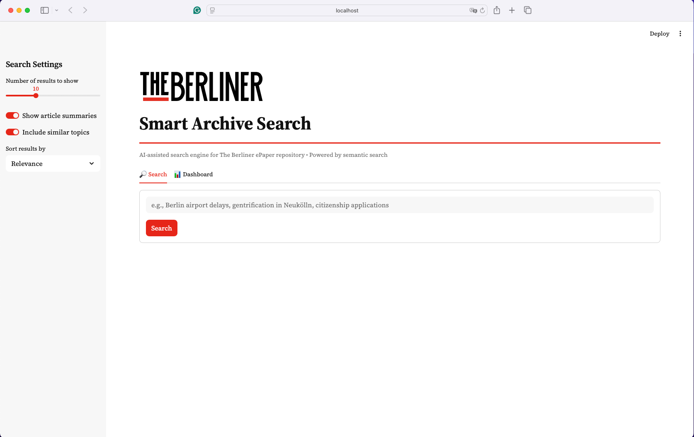
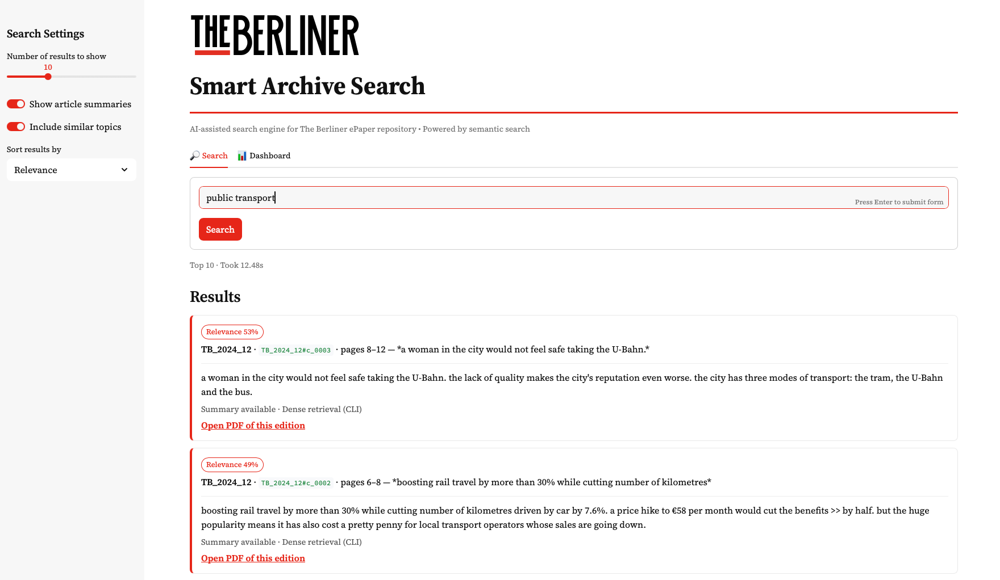
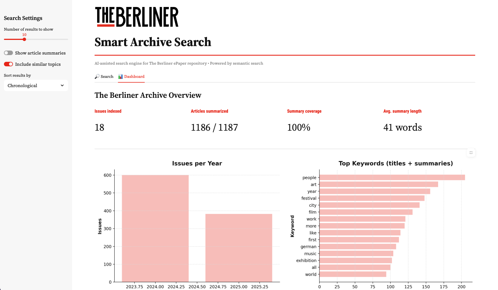
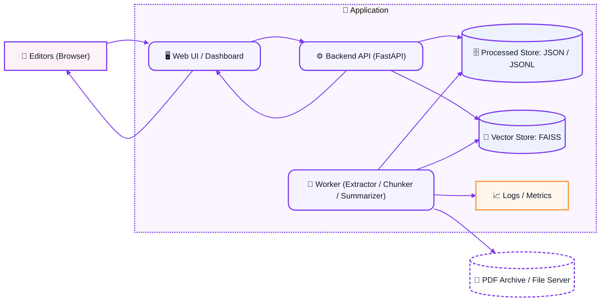

# 📰 The Berliner Search

**Public Version (Data Removed for Privacy)**

The **Berliner Search** is an AI-assisted research tool that transforms _The Berliner_ magazine’s PDF archive into structured, searchable data.  
It turns static PDFs into summaries, metadata, and semantic embeddings to enable fast, intelligent search over two decades of content.

This repository contains a **public-safe case-study version** of the project architecture and code structure.  
All proprietary data, real PDFs, or internal configurations have been **removed** for privacy and security.

---

## 🔒 Privacy & Security Notice

To protect the magazine’s content and infrastructure:

- No PDFs or extracted text are included
- No summaries, embeddings, or FAISS index data are included
- `data/` contains only placeholders (no real archive content)
- `config.yaml` uses only local, generic paths and model names (no secrets, no internal servers)
- The Streamlit app in this repo runs on **synthetic demo results** and never accesses the real archive

This repository is intended to show **how the system works**, not to publish internal content.  
For a private walkthrough or demo with real data, please get in touch.

---

## 🎯 MVP Goal

Convert a static multi-year PDF archive into a **searchable dataset** combining:

- AI summarization
- NLP preprocessing
- Semantic embedding search
- Lightweight UI for internal use

---

## ✅ Features Implemented

### 📄 Data Processing

- PDF extraction and parsing
- Multi-column layout handling
- Metadata tagging (issue, section, page)

### 🧹 NLP Preprocessing

- Text cleaning & normalization
- Chunking into semantically coherent segments

### 📝 Summarization

- Automatic article summaries using **T5-small**

### 🔍 Semantic Search

- Embedding generation with **MiniLM-multilingual**
- FAISS vector index for fast similarity search
- Hybrid metadata + vector ranking (optional)

### 📊 Evaluation

- Scripts to test precision and relevance
- Tools for comparing query performance across models

---

## 🖼️ UI Screenshots

### Search Interface



### Search Results with Summaries



### Dashboard The Berliner Archive



---

## 📅 Project Status (2025)

The integrated semantic search model in the internal system is:

```
sentence-transformers/paraphrase-multilingual-MiniLM-L12-v2
```

It supports **English and German queries** and provides a reliable baseline for semantic search performance.

---

## 🧱 System Architecture – The Berliner Search MVP

High-level components:

- **Worker pipeline**: PDF extract → clean → chunk → summarize → embed → store
- **Processed Store**: JSON/JSONL summaries and metadata
- **Vector Store**: FAISS index over embeddings for semantic search
- **Backend API**: serves summaries + ranked search results
- **Web UI**: lightweight dashboard for editors to query the archive

---

## 🧩 System Architecture – The Berliner Search MVP



- Editors interact with a Web Dashboard, which talks to a FastAPI backend.
- The backend serves content from two stores:

1. A Processed JSON store (for summaries)

2. A Vector store (for semantic search).

- Meanwhile, a background worker reads new PDFs from the archive, processes them (extract, clean, chunk, summarize), and writes the results back to those stores — logging everything along the way.

- The user → API → data → UI loop makes the system interactive;
- the worker → stores pipeline keeps data updated.

---

## 📂 Repository Structure (Public Version)

```
berliner/
│
├── extractor/       # PDF → text pipeline (sanitized)
├── chunker/         # Chunking logic
├── summarizer/      # T5 summarization wrapper
├── search/          # Embedding + FAISS search
└── ui/              # Streamlit demo UI (synthetic results only)
```

`data/` contains only placeholders:  
real PDFs, text, embeddings, and indexes are not part of this public repo.

---

## ▶️ Demo UI (Public Case-Study)

The included Streamlit app is a **static demo UI**:

- Shows the real layout and interaction pattern
- Uses **synthetic example results** (no real magazine content)
- Does not read PDFs, metadata, embeddings, or FAISS indexes

Run:

```bash
pip install -r requirements.txt
streamlit run berliner/ui/app_streamlit.py
```

This is intended to demonstrate the interface, not the actual search quality of the internal system.

---

## ▶️ Using the Code with Your Own Data

If you want to adapt this project to your own PDFs:

1. Place your PDFs under `data/raw_pdfs/`.
2. Adjust local paths and parameters in `config.yaml`.
3. Use the CLI pipeline to:
   - extract text and metadata,
   - create chunks,
   - generate summaries,
   - build embeddings and a FAISS index.
4. Run search via:

```bash
python -m berliner.cli search "example query"
```

(The exact CLI commands depend on your chosen workflow and are not fully documented here.)

---

## 📬 Contact

For questions or a private demonstration of the complete system get in touch

---

## 👩‍💻 Author

Developed as part of an **AI Project Management Capstone Project (2025) by Vanesa Yepes and The Berliner Magazine team**.
