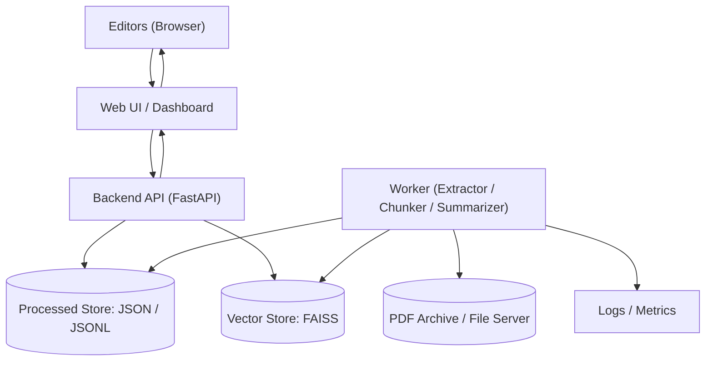

# The Berliner Search

Short MVP: parse PDFs → JSON.

## 🧩 System Architecture – The Berliner Search MVP

```mermaid
graph TD;
  U["Editors (Browser)"] --> UI["Web UI / Dashboard"];
  UI --> API["Backend API (FastAPI)"];
  API --> P[(Processed Store: JSON / JSONL)];
  API --> V[(Vector Store: FAISS)];
  W["Worker (Extractor / Chunker / Summarizer)"] --> A[(PDF Archive / File Server)];
  W --> P;
  W --> V;
  W --> L["Logs / Metrics"];
  API --> UI;
  UI --> U;

```
